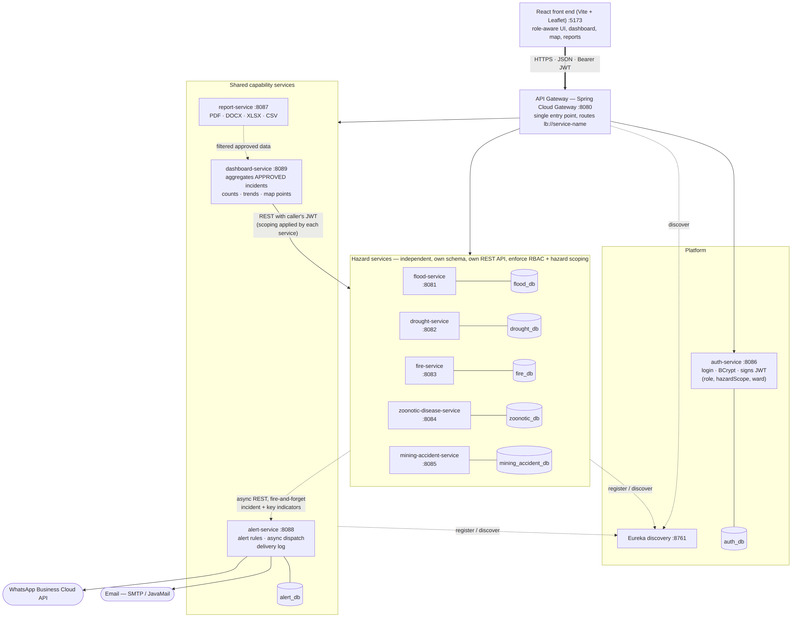
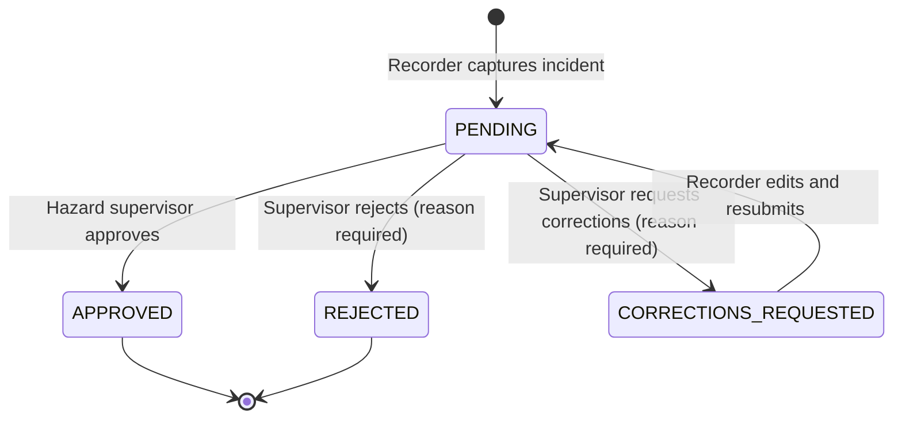

# DPDMS — Rushinga Provincial Disaster Monitoring and Management System

A role-aware, micro-services platform that captures hazard incidents at ward level, routes each one through a hazard-specific approval workflow, publishes approved incidents to a live dashboard and map, generates reports in four formats, and sends email and WhatsApp alerts.

Five hazards are covered, each as its own independently deployable Spring Boot service with its own MySQL schema: **floods, droughts, fires, zoonotic diseases and mining accidents**.

---

## Contents

1. [Architecture](#1-architecture)
2. [Services and ports](#2-services-and-ports)
3. [Technology choices](#3-technology-choices)
4. [Getting started](#4-getting-started)
5. [Demo accounts](#5-demo-accounts)
6. [Approval workflow](#6-approval-workflow)
7. [How hazard-level scoping is enforced](#7-how-hazard-level-scoping-is-enforced)
8. [Alerts](#8-alerts)
9. [Dashboard and map](#9-dashboard-and-map)
10. [Reports](#10-reports)
11. [Shared incident model and key indicators](#11-shared-incident-model-and-key-indicators)
12. [API documentation](#12-api-documentation)
13. [Testing](#13-testing)
14. [Non-functional requirements](#14-non-functional-requirements)
15. [Repository layout](#15-repository-layout)

---

## 1. Architecture



*(Mermaid source: [`docs/architecture.mmd`](docs/architecture.mmd))*

- **One entry point.** The React front end only talks to the **API Gateway** (Spring Cloud Gateway, port 8080). The gateway resolves every route through **Eureka** (`lb://service-name`), so services can change port or run several instances without configuration changes.
- **One service per hazard.** Each hazard service owns its database schema, its REST API, its build artifact and its approval workflow. None of them reads another's database.
- **Shared capabilities are services, not copies.** Alerting, dashboard aggregation and report generation are each implemented once and used by all five hazards.
- **Communication is REST over HTTP.** We chose REST over a message broker to keep the deployment small (no broker to run) while still meeting the asynchronous-alert requirement:
  - Hazard service → alert-service: **asynchronous, fire-and-forget** HTTP (`HttpClient.sendAsync`). Incident capture never waits for it, and a failure is logged rather than surfaced.
  - dashboard-service → hazard services: parallel REST calls that **forward the caller's JWT**, so each hazard service applies its own access rules.
  - Services locate each other through Eureka's `DiscoveryClient`, with configurable fallback URLs.

## 2. Services and ports

| Service | Folder | Port | Database | Purpose |
|---|---|---|---|---|
| Discovery (Eureka) | `discovery-service` | 8761 | – | Service registry |
| API Gateway | `dpdms-api-gateway` | 8080 | – | Single entry point, routing, CORS |
| Auth | `auth-service` | 8086 | `auth_db` | Login, BCrypt passwords, issues signed JWTs |
| Flood | `flood` | 8081 | `flood_db` | Flood incidents + workflow |
| Drought | `drought` | 8082 | `drought_db` | Drought incidents + workflow |
| Fire | `fire` | 8083 | `fire_db` | Fire incidents + workflow |
| Zoonotic disease | `zoonotic-disease-service` | 8084 | `zoonotic_db` | Zoonotic incidents + workflow |
| Mining accident | `mining-accident-service` | 8085 | `mining_accident_db` | Mining accidents + workflow |
| Report | `report-service` | 8087 | – | PDF / DOCX / XLSX / CSV generation |
| Alert | `alert-service` | 8088 | `alert_db` | Alert rules, async email + WhatsApp, delivery log |
| Dashboard | `dashboard-service` | 8089 | – | Aggregates approved incidents: counts, trends, map |
| Front end | `flood-frontend` | 5173 | – | React application |

Gateway routes:

| Path | Service |
|---|---|
| `/api/auth/**` | auth-service (prefix stripped) |
| `/api/floods/**` | flood-service |
| `/api/drought/**` | drought-service |
| `/api/fire-incidents/**`, `/api/audit/**` | fire-service |
| `/api/zoonotic-incidents/**`, `/api/audit-trails/**` | zoonotic-disease-service |
| `/api/mining-accidents/**` | mining-accident-service |
| `/api/reports/**` | report-service |
| `/api/alerts/**` | alert-service |
| `/api/dashboard/**` | dashboard-service |

## 3. Technology choices

- **Backend:** Java 21, Spring Boot (Web MVC, Data JPA, Security, Validation, Actuator), Spring Cloud Netflix Eureka and Spring Cloud Gateway, JJWT 0.12, springdoc-openapi.
- **Database:** MySQL 8, one schema per service.
- **Front end: React** (Vite, react-leaflet). We chose React because:
  - The dashboard is highly interactive (filters, live counts, a map with pop-ups, drill-down into each hazard). A component-based single-page app suits this better than server-rendered Thymeleaf pages.
  - React talks to the gateway purely over the same REST API that other clients use. This keeps the backend services stateless and independently deployable, with no server-side views tied to any one service.
  - Leaflet has first-class React bindings, which made the incident map simple to build.
  - Most of the team already knew JavaScript, so React let the five members build hazard panels in parallel with a shared structure.

## 4. Getting started

### Prerequisites

- JDK 21
- MySQL 8 running locally (user `root`)
- Node.js 20+
- Maven, or the included `mvnw` / `mvnw.cmd` wrappers

### 1. Configure environment variables

No credentials are stored in the source code. Copy the template and fill it in:

```bash
cp dpdms.env.example dpdms.env      # Windows: copy dpdms.env.example dpdms.env
```

The two required variables are `DB_PASSWORD` (your MySQL root password) and `JWT_SECRET` (any random string of 32+ characters, shared by all services). Email and WhatsApp credentials are optional. Without them, alerts are still evaluated and logged, with delivery status `SIMULATED`.

In IntelliJ you can instead add the same variables to each run configuration under *Environment variables*.

### 2. (Optional) Load schema and demo data

Each service creates its own tables on start-up (`spring.jpa.hibernate.ddl-auto=update`). To also load the demo incidents (about 60 across all hazards, spread over the last 12 months around Rushinga):

```powershell
powershell -ExecutionPolicy Bypass -File scripts\load-seed-data.ps1
```

Or run the files in [`database/`](database/) in order with any MySQL client. User accounts are created by the services at start-up, because passwords must be BCrypt-hashed.

### 3. Start everything

**Windows, one command:**

```powershell
powershell -ExecutionPolicy Bypass -File scripts\start-all.ps1
```

**Manually,** in this order, each in its own terminal with the environment variables set:

```bash
cd discovery-service && ./mvnw spring-boot:run      # wait until Eureka is up
cd auth-service && ./mvnw spring-boot:run
cd flood && ./mvnw spring-boot:run                  # and drought, fire,
                                                    # zoonotic-disease-service,
                                                    # mining-accident-service
cd alert-service && ./mvnw spring-boot:run
cd report-service && ./mvnw spring-boot:run
cd dashboard-service && ./mvnw spring-boot:run
cd dpdms-api-gateway && ./mvnw spring-boot:run      # last
cd flood-frontend && npm install && npm run dev
```

Then open:
- **http://localhost:5173** for the application
- **http://localhost:8761** for Eureka, where every service should be listed as UP

### 4. Build and test everything

```bash
for m in discovery-service auth-service dpdms-api-gateway flood drought fire \
         zoonotic-disease-service mining-accident-service alert-service \
         dashboard-service report-service; do (cd $m && ./mvnw -q verify) ; done
cd flood-frontend && npm run build
```

## 5. Demo accounts

All demo accounts use the password **`password123`**. They are created by `auth-service` on start-up.

| Username | Role | Hazard scope | Ward | Can do |
|---|---|---|---|---|
| `flood_recorder` | RECORDER | FLOOD | Ward 1 | Capture and edit own flood records in Ward 1 |
| `flood_recorder_w2` | RECORDER | FLOOD | Ward 2 | Same, Ward 2 (demonstrates ward scoping) |
| `drought_recorder`, `fire_recorder`, `zoonotic_recorder`, `mining_recorder` | RECORDER | own hazard | Ward 1 | Capture own hazard only |
| `flood_supervisor` … `mining_supervisor` | SUPERVISOR | own hazard | – | Approve / reject / request corrections for one hazard |
| `provincial_admin` | ADMIN | ALL | – | Read-only; may see pending records of every hazard |
| `national_user` | NATIONAL | ALL | – | Read-only; approved records of all hazards, dashboard, reports |

Only an ADMIN token can create further users (`POST /api/auth/register`), so nobody can give themselves a role.

## 6. Approval workflow



- A new record is **always** stored as `PENDING`, whatever status the client sends. Editing can never change the approval status.
- Only `PENDING` records can be approved, rejected or sent back. Approving twice, or approving a rejected record, returns `400`.
- Rejection and correction requests require a reason, which is stored on the record.
- When the recorder edits a record that was sent back, it automatically returns to `PENDING`.
- An approved record can no longer be edited or deleted by the recorder.
- **Audit trail.** Every transition (capture, edit, resubmission, approval, rejection, correction request, deletion) is written to the service's audit table. Each entry records **who acted**, taken from the signed JWT and never from a request parameter or header, **when**, and **what changed** (previous and new status, plus the reason). It is available at e.g. `GET /api/floods/{id}/audit`.
- **Visibility of unapproved records.** A pending record is visible only to:
  - the recorder who captured it,
  - the supervisor of that hazard,
  - the provincial administrator.

  It never appears for national users, on the dashboard, on the map or in reports.

Status names differ slightly between services because each was built by a different team member (e.g. `CORRECTIONS_REQUESTED` in flood, `NEEDS_CORRECTION` in fire). The dashboard normalises them.

## 7. How hazard-level scoping is enforced

Scoping is enforced **in the backend, in every service**. The front end only hides buttons as a convenience.

**1. The token carries the scope.** On login, auth-service signs a JWT (HMAC-SHA, shared `JWT_SECRET`) with the claims `role`, `hazardScope` and `ward`. Supervisors and recorders are issued exactly one hazard; only ADMIN and NATIONAL users get `ALL`.

**2. Each hazard service checks the hazard at its edge.** Every hazard service has a JWT filter that runs before any controller. It rejects a request with **`403 Forbidden`** unless one of these is true:
- the token's `hazardScope` is the service's own hazard, or
- the scope is `ALL` **and** the role is `NATIONAL` or `ADMIN`.

Tokens with no `hazardScope`, and recorders or supervisors claiming `ALL`, are rejected. So a flood supervisor calling the drought service is refused **by the drought service itself**.

**3. Roles decide which operations are allowed.** Spring Security rules in each service:

| Operation | RECORDER | SUPERVISOR | ADMIN | NATIONAL |
|---|---|---|---|---|
| Create / update / delete | ✔ (own ward, own records) | ✘ | ✘ | ✘ |
| Approve / reject / request corrections | ✘ | ✔ (own hazard) | ✘ | ✘ |
| Read approved records | ✔ | ✔ | ✔ | ✔ |
| Read pending records | own only | ✔ | ✔ | ✘ |

Every write by a NATIONAL or ADMIN user returns `403`.

**4. Ward scoping is checked on the record.** Authority at ward level is the pair (ward, hazard). The controller compares the token's `ward` with the record's ward:
- on create, a recorder cannot capture for another ward;
- on update and delete, a recorder must also be the record's reporter, and the record must not be approved.

The reporter is always set from the token.

**5. Shared services apply the same scope.**
- **dashboard-service** only queries the hazards in the caller's scope and forwards the caller's token, so hazard services apply rules 2–4 again.
- **alert-service** refuses an alert for a hazard outside the token's scope.
- **Reports** are built from the dashboard feed, so they inherit the same rules.

Unit tests cover these rules; see [Testing](#13-testing).

## 8. Alerts

**How an alert is raised.** After an incident is captured or edited, the hazard service posts a summary (metadata, GPS and its five key indicators) to **alert-service** asynchronously. It forwards the user's token and never waits for the response.

**Alerting criteria.** These are defined once, in `AlertRules`, and the thresholds are configurable through environment variables:

| Hazard | Alert when |
|---|---|
| Flood | Peak water level ≥ danger level (default **3.0 m**, `FLOOD_DANGER_LEVEL_M`), or severity HIGH / CRITICAL |
| Drought | Crop failure ≥ **50 %** (`DROUGHT_CROP_FAILURE_PCT`), or severity HIGH / CRITICAL |
| Fire | The fire is still **active** (not contained) |
| Zoonotic | Classified as a **cluster or outbreak**, or any confirmed human case |
| Mining | Any **fatalities** or trapped / injured miners |

**Dispatch.** If the criteria are met, alert-service returns `202 Accepted` at once. Delivery then runs on a bounded background thread pool (`alertExecutor`) to every active subscriber of that hazard:
- by **email** through JavaMail (SMTP settings from `MAIL_*`);
- by **WhatsApp** through the **WhatsApp Business Cloud API** (`WHATSAPP_TOKEN`, `WHATSAPP_PHONE_NUMBER_ID`).

The message includes the location, severity, the reason for the alert and a Google Maps link to the GPS point.

**Delivery log.** Every attempt is stored in `alert_log` with the hazard, incident, **channel, recipient, timestamp and delivery status**:
- `SENT` — accepted by the provider;
- `FAILED` — the provider returned an error, which is stored with the attempt;
- `SIMULATED` — no credentials were configured.

Supervisors see the log for their own hazard; admin and national users see all (`GET /api/alerts/logs`). It is also shown on the dashboard.

**Subscribers.** Recipients are managed by the provincial administrator (`/api/alerts/subscribers`). Each subscriber can follow some hazards or `ALL`.

**Reliability.** If alert-service is down, incident capture still succeeds. The hazard service only logs a warning.

## 9. Dashboard and map

The dashboard (`GET /api/dashboard/overview`) is built by **dashboard-service** from **approved incidents only**. It shows:
- incident counts by hazard, by severity and by status (e.g. fire ACTIVE / CONTAINED, mining RESCUE_ONGOING, zoonotic CLUSTER / OUTBREAK);
- the 10 most recent incidents;
- a monthly trend per hazard over 12 months;
- the recent alert log.

It can be filtered by hazard, ward, district, severity and date range.

**Map.** Every approved incident with GPS coordinates is drawn on an OpenStreetMap / Leaflet map:
- markers are coloured by hazard and sized by severity;
- clicking a marker opens its details (location, date, severity, status and all five key indicators).

**Who sees what.** National users and the provincial admin see all five hazards and can drill into each hazard's panel. Recorders and supervisors open the same dashboard from the **Dashboard, map & reports** button, limited to their own hazard.

**Reliability.** If a hazard service is down, the dashboard still loads and lists that hazard under *temporarily unavailable*.

## 10. Reports

**report-service** (port 8087) generates **PDF, Word (DOCX), Excel (XLSX) and CSV** files. It is the only place report code lives; no hazard service duplicates it. It offers two endpoints:

| Endpoint | Purpose |
|---|---|
| `GET /api/reports/incidents?format=PDF&hazard=&ward=&district=&severity=&from=&to=` | Incident report built from live data, downloadable directly through the API |
| `POST /api/reports/generate` with `{title, format, columns, rows}` | Generic generator, used by the endpoint above and available to other services |

**Filters:** hazard, ward, district, severity and date range (`yyyy-MM-dd`, inclusive). **Approval status:** only approved records are ever included, as the brief requires for reports.

**Where the data comes from.** `/api/reports/incidents` reads from dashboard-service with the **caller's own token**. That means:
- the report contains **approved records only**;
- it only covers the hazards the caller may see (a flood supervisor can never produce a drought report);
- if the data source is down, report-service returns `503` with a clear message instead of failing silently.

**Format details:**
- PDF: landscape A4 table with the header repeated on every page, and a title, generation time and record count.
- XLSX: bold header row.
- CSV: correctly quoted.

On the dashboard, the *Report: PDF / DOCX / XLSX / CSV* buttons call this endpoint with the current filters and download the file.

```bash
curl -H "Authorization: Bearer $TOKEN" -o floods.pdf \
  "http://localhost:8080/api/reports/incidents?format=PDF&hazard=FLOOD&from=2026-01-01"
```

## 11. Shared incident model and key indicators

Every hazard record carries the same metadata:
- ward, district, province;
- date / time of occurrence;
- reporter;
- severity (LOW / MEDIUM / HIGH / CRITICAL);
- approval status;
- **GPS latitude and longitude, captured at ward level on entry**.

dashboard-service normalises all five hazards into this shape (`IncidentView`) so the dashboard, map and reports can aggregate them uniformly.

| Hazard | Key indicators |
|---|---|
| Flood | peak water level (m), river basin, households displaced, area flooded (ha), duration of inundation (days) |
| Drought | rainfall deficit (mm), consecutive dry days, crop failure %, people facing water shortages, livestock mortality |
| Fire | area burned (ha), suspected cause (natural / accidental / deliberate), injuries or fatalities, structures destroyed, active or contained |
| Zoonotic | disease (e.g. anthrax, rabies, brucellosis), animal species, confirmed human cases, confirmed animal cases, cluster or outbreak |
| Mining | mine name and type (formal / artisanal), accident type (collapse, gas explosion, flooding, fall of ground), trapped or injured miners, fatalities, rescue ongoing |

## 12. API documentation

Every service publishes an OpenAPI description and Swagger UI. Use the **Authorize** button with a token from `POST http://localhost:8080/api/auth/login`.

| Service | Swagger UI |
|---|---|
| Auth | http://localhost:8086/swagger-ui.html |
| Flood | http://localhost:8081/swagger-ui.html |
| Drought | http://localhost:8082/swagger-ui.html |
| Fire | http://localhost:8083/swagger-ui.html |
| Zoonotic | http://localhost:8084/swagger-ui.html |
| Mining | http://localhost:8085/swagger-ui.html |
| Report | http://localhost:8087/swagger-ui.html |
| Alert | http://localhost:8088/swagger-ui.html |
| Dashboard | http://localhost:8089/swagger-ui.html |

Machine-readable specs are at `/v3/api-docs` on each service.

Example, from login to a scoped call:

```bash
TOKEN=$(curl -s -X POST http://localhost:8080/api/auth/login -H "Content-Type: application/json" \
  -d '{"username":"flood_supervisor","password":"password123"}' | sed 's/.*"token":"\([^"]*\)".*/\1/')

curl -H "Authorization: Bearer $TOKEN" http://localhost:8080/api/floods                   # 200
curl -H "Authorization: Bearer $TOKEN" http://localhost:8080/api/drought/incidents        # 403 - wrong hazard
```

## 13. Testing

```bash
cd <service> && ./mvnw test
```

| Area | Tests |
|---|---|
| Hazard scoping at the service edge | `HazardScopingFilterTest` in flood, drought, fire and mining. Other-hazard, scope-less and recorder-with-`ALL` tokens → 403; own hazard and national → allowed |
| Ward scoping and visibility | `FloodIncidentControllerScopingTest`: capture in another ward → 403; reporter taken from the token; national sees approved only; recorder sees own pending only; cannot edit others' or approved records; approval attributed to the authenticated supervisor |
| Approval workflow | `FloodApprovalWorkflowTest`, `MiningApprovalWorkflowTest`, `FireIncidentServiceTest`, `DroughtIncidentServiceTest`, `ZoonoticIncidentServiceTest`: always PENDING on create, PENDING-only transitions, reasons required, resubmission after corrections, actor in audit trail |
| Alert criteria | `AlertRulesTest`: every hazard's threshold, both sides |
| Alert API scoping | `AlertControllerSecurityTest` (MockMvc): cross-hazard and national alerts rejected, log scoping, admin-only subscribers |
| Dashboard | `DashboardServiceTest`: scoping, pending records dropped, normalisation, date filters, trends, graceful degradation |
| Integration | `DroughtIncidentControllerTest` (Spring Boot + database) |

## 14. Non-functional requirements

- **Security**
  - JWT authentication with signed tokens and BCrypt-hashed passwords.
  - RBAC and hazard / ward scoping enforced in every service, as described in section 7.
  - Bean Validation on incident input, e.g. latitude −90…90 and non-negative counts.
  - JPA parameter binding throughout, with no string-built SQL, which protects against SQL injection.
  - A JSON-only API. React escapes all rendered output, which protects against XSS.
  - All secrets come from environment variables.
  - In production, terminate HTTPS at the gateway (`server.ssl.*`).
- **Reliability**
  - Alerting is asynchronous, and hazard services keep working if alert-service is down.
  - The dashboard reports an unavailable hazard service instead of failing.
  - The front end shows an error if report-service is unavailable, without affecting anything else.
- **Scalability**
  - Every service is stateless apart from its own database, and is found through Eureka.
  - More instances of any hazard service can be started (the gateway load-balances `lb://` routes).
  - Adding a new province means adding users and data, not code.
- **Observability**
  - Spring Boot Actuator on every service: `/actuator/health`, `/actuator/info`, `/actuator/metrics`.
  - Eureka's dashboard shows service status.
  - Structured logs from every service; alert delivery failures are logged with the reason.
- **Documentation:** OpenAPI / Swagger on every service, this README, and the architecture diagram.

## 15. Repository layout

```
auth-service/                  JWT issuing, users
discovery-service/             Eureka server
dpdms-api-gateway/             Spring Cloud Gateway
flood/  drought/  fire/        hazard services
zoonotic-disease-service/      hazard service
mining-accident-service/       hazard service
alert-service/                 alert rules, async email + WhatsApp, alert log
dashboard-service/             approved-incident aggregation for dashboard, map, reports
report-service/                PDF / DOCX / XLSX / CSV generation
flood-frontend/                React front end (all hazards, dashboard, map)
database/                      MySQL schema + seed data, one file per service
docs/                          architecture diagram
scripts/                       start-all.ps1, load-seed-data.ps1
dpdms.env.example              environment variable template
```

### Team

Each member built one hazard end to end, then the group integrated and tested the system together.

| Hazard / component | GitHub |
|---|---|
| Flood service, auth-service, front end, integration | @Nevada257 |
| Drought service, discovery service | @Trixxie-art |
| Fire service | @aka-hub-hub |
| Zoonotic disease service | @mpofutinah-dev |
| Mining accident service, API gateway | @faye904 |
